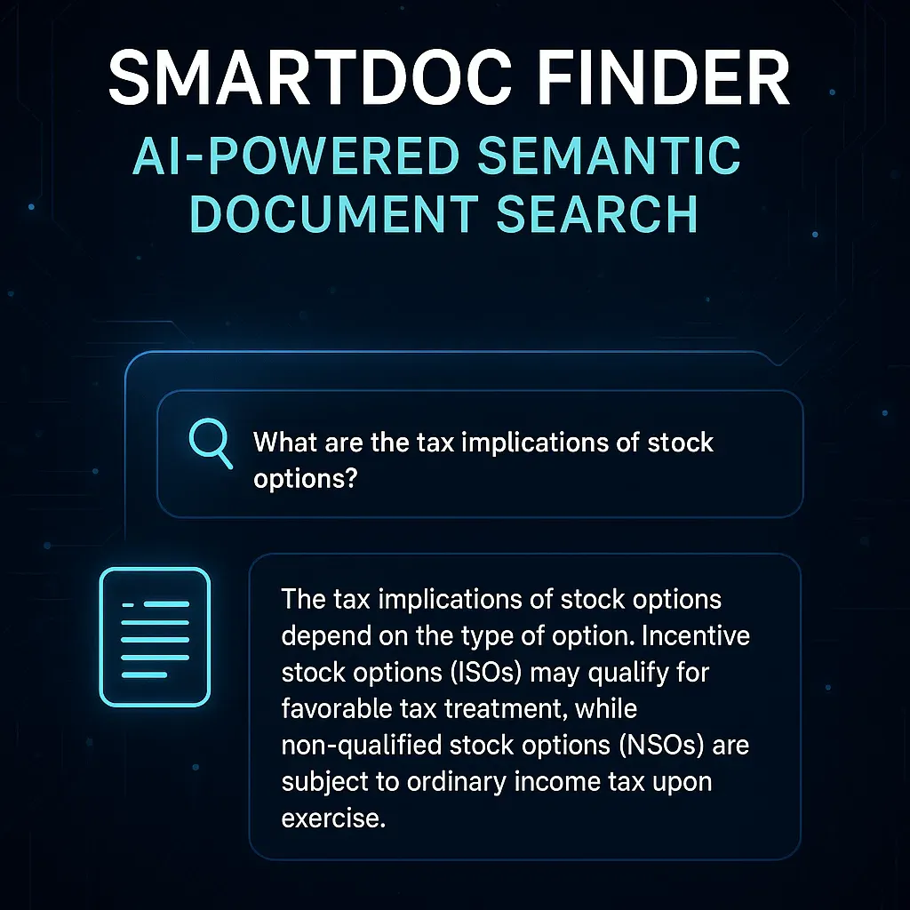

# SmartDoc Finder - AI-Powered Semantic Document Search

Create an intelligent document search tool where users can ask questions in plain English, and the system returns not just a list of documents, but actual answers pulled and reasoned from those documents — leveraging both FAISS DB and Langchain for power and flexibility. [Idea from [Top 8 LLM + RAG Projects for your AI Portfolio 2025](https://medium.com/ai-in-plain-english/top-8-llm-rag-projects-for-your-ai-portfolio-2025-c721a5e37b43)]



## Tools & Technologies

- FAISS — to store and retrieve embeddings of documents
- Langchain — to handle chaining of LLM prompts, memory, and logic
- OpenAI / LLaMA / Claude — as LLM backend (via Langchain)
- Streamlit or React — for a quick and elegant front-end

## Step-by-Step Design Process

1. Data Ingestion & Preprocessing
   - Upload PDFs, docs, or scraped text.
   - Chunk documents (e.g., 500–1000 tokens) for more accurate embedding.
   - Generate embeddings for each chunk using Langchain’s wrapper around an embedding model (OpenAI, Hugging Face, etc.).
   - Store all vector embeddings with references in FAISS DB.

2. Semantic Search
   - User inputs a natural language query (e.g., “What are the benefits of AI in logistics?”)
   - Langchain converts the query into an embedding vector.
   - FAISS searches for top N most semantically similar document chunks.

3. Intelligent Answering
   - Langchain passes retrieved chunks as context to the LLM.
   - The LLM then: Summarizes, Extracts answers, Or holds a conversation about the documents

4. UI & Interaction
   - Display top results with:
   - Highlighted source chunks
   - Direct answer
   - Option to “ask follow-up” or "read more".

## Real-World Applications

- Internal document search for large corporations
- Smart customer support (pulling from manuals, FAQs)
- Academic paper search engines
- Personal knowledge management systems (Second Brain)

## Bonus Upgrade Ideas

- Add document tagging and filtering (e.g., date, topic).
- Train with company-specific language or jargon.
- Implement a feedback loop to fine-tune search quality.

## Ollama setup

   ollama pull llama3.1:8b
	ollama show llama3.1:8b

## How to Run

1. **Install Dependencies**:
    ```bash
    conda create --name leet_aider python=3.12
    conda activate leet_aider
    python -m pip install pandas requests beautifulsoup4 faiss-cpu sentence-transformers
    ```